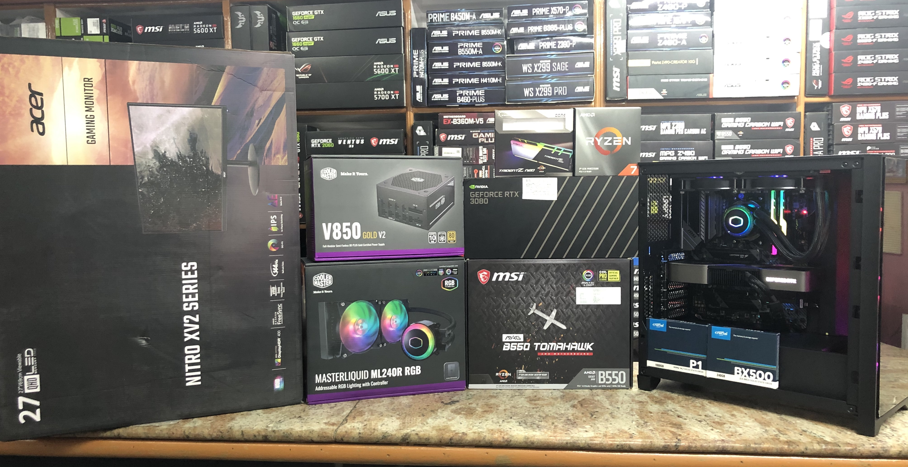
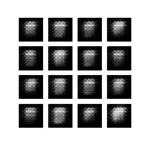

# 100 Days of ML
 

Daily log to track my progress on the 100 days of ML code challenge.

## Description
100 Day ML Challenge to learn and implement ML/DL concepts ranging from the basics to more advanced state of the art models.

## Daily Logs
<h3>Day 1 [09/09/20]: Multivariate Linear Regression</h4>
<ul>
	<li>Started <a href="">Machine Learning by Stanford University</a> course on Coursera.</li>
	<li>Utilized TensorFlow tensors for matrix multiplication.</li>
	<li>Created an informative notebook for multivariate regression.</li>
</ul>
<h3>Day 2 [10/09/20]: Applying Regression</h3>
<ul>
	<li>Used the Seoul Bike Sharing Demand dataset found at <a href="https://archive.ics.uci.edu/ml/datasets.php?format=&task=reg&att=&area=&numAtt=&numIns=&type=&sort=nameUp&view=table">UCI Machine Learning Repository</a> for multivariate regression</li>
	<li>Utilized the Keras library through TensorFlow.</li>
	<li>Used a Sequential model with two hidden layers.</li>
</ul>
<h3>Day 3 [13/09/20]: Custom Regression Model</h3>
<ul>
	<li>Building a custom hand tuned regression model based on previous results.</li>
	<li>Trained using basic matrix operations and Adam optimizer</li>
	<li>Watched Stanford's CS229 lecture on <a href="https://www.youtube.com/watch?v=4b4MUYve_U8&list=PLoROMvodv4rMiGQp3WXShtMGgzqpfVfbU&index=2">Linear Regression and Gradient Decent</a> taught by Andrew Ng.</li>
</ul>
<h3>Day 4 [14/09/2020]: Generative Discriminative</h3>
<ul>
	<li>Watched Stanford's CS299 lecture on <a href="https://www.youtube.com/watch?v=nt63k3bfXS0&list=PLoROMvodv4rMiGQp3WXShtMGgzqpfVfbU&index=5">GDA & Naive Bayes.</a></li>
	<li>Noted the difference between Generative and Discriminative models.</li>
</ul>
<h3>Day 5 [15/09/20]: Naive Bayes</h3>
<ul>
	<li>Started a mini-project on classifying Iris flowers using Naive Bayes.</li>
	<li>Learned a lot about Naive Bayes through several videos on youtube such as
		<ul>
			<li><a href="https://www.youtube.com/watch?v=HZGCoVF3YvM">Bayes theorem.</a></li>
			<li><a href="https://www.youtube.com/watch?v=O2L2Uv9pdDA">Naive Bayes, Clearly Explained!!!</a></li>
			<li><a href="https://www.youtube.com/watch?v=H3EjCKtlVog">Gaussian Naive Bayes, Clearly Explained!!!</a></li>
		</ul>
	</li>
</ul>
<h3>Day 6 [16/09/20]: Naive Bayes Project</h3>
<ul>
	<li>Finished the Iris Flower Classifier using Naive Bayes.</li>
	<li>Reached an accuracy of about 96%</li>
</ul>
<h3>Day 7 [17/09/20]: Support Vector Machines.</h3>
<ul>
	<li>Learned a lot about Support Vector Machines by watching several videos on youtube such as</li>
	<ul>
		<li>Stanford's CS299 lecture on <a href="https://youtu.be/lDwow4aOrtg?list=PLoROMvodv4rMiGQp3WXShtMGgzqpfVfbU&t=2788">Support Vector Machines.</a></li>
		<li><a href="https://www.youtube.com/watch?v=efR1C6CvhmE">Support Vector Machines, Clearly Explained!!!</a></li>
		<li>MIT 6.034 Artificial Intelligence lecture 16 on <a href="https://www.youtube.com/watch?v=_PwhiWxHK8o&t=1s">Learning: Support Vector Machines.</a></li>
	</ul>
</ul>
<h3>Day 8 [18/09/20]: SVM Project</h3>
<ul>
	<li>Started a project on classifying <a href="https://archive.ics.uci.edu/ml/datasets/Breast+Cancer+Wisconsin+(Diagnostic)">Breast Cancer Tumors </a>using SVM.</li>
	<li>Followed a <a href="https://www.youtube.com/watch?v=mA5nwGoRAOo">tutorial</a> on youtube by Sentdex on SVM.</li>
	<li>Received and accuracy in the range of around 97%</li>
</ul>
<h3>Day 9 [19/09/20]: Classification</h3>
<ul>
	<li>Going back to the basics and approaching classification from a mathematical standpoint.</li>
	<li>Completed the Classification and Representation section in the <a href="https://www.coursera.org/learn/machine-learning">Machine Learning</a> course by Stanford on coursera.</li>
</ul>
<h3>Day 10 [20/09/20] Kernels</h3>
<ul>
	<li>Watched Stanford's CS299 lecture on <a href="https://www.youtube.com/watch?v=8NYoQiRANpg&list=PLoROMvodv4rMiGQp3WXShtMGgzqpfVfbU&index=8&t=0s">Kernels.</a></li>
	<li>Learned the representer theorem.</li>
</ul>
<h3>Day 11 [21/09/20] Kernels continued.</h3>
<ul>
	<li>Finished the Stanford CS299 lecture on <a href="https://www.youtube.com/watch?v=8NYoQiRANpg&list=PLoROMvodv4rMiGQp3WXShtMGgzqpfVfbU&index=8&t=0s">Kernels.</a></li>
	<li>Learned about the complexity difference when using inner product.</li>
</ul>
<h3>Day 12 [23/09/20] Bias and Variance</h3>
<ul>
	<li>Watched Stanford's CS299 lecture on <a href="https://www.youtube.com/watch?v=rjbkWSTjHzM&list=PLoROMvodv4rMiGQp3WXShtMGgzqpfVfbU&index=8">Data Splits, Models & Cross-Validation.</a></li>
	<li>Learned about</li>
	<ul>
		<li>Over fitting and under fitting in terms of bias and variance.</li>
		<li>The regularization technique.</li>
	</ul>
</ul>
<h3>Day 13 [24/09/2020] Cross-Validation</h3>
<ul>
	<li>Finished watching the CS299 lecture on Cross Validation.</li>
	<li>Learned about</li>
	<ul>
		<li>How and when to use k-fold cross validation.</li>
		<li>How and when to use leave-out-out cross validation.</li>
		<li>Feature selection.</li>
	</ul>
</ul>
<h3>Day 14 [25/09/2020] Approx/Estimation Error</h3>
<ul>
	<li>Watched Stanford's CS299 lecture on <a href="https://www.youtube.com/watch?v=iVOxMcumR4A&list=PLoROMvodv4rMiGQp3WXShtMGgzqpfVfbU&index=9">Approx/Estimation Error</a>.</li>
	<li>Learned about:</li>
	<ul>
		<li>Sampling Distributions</li>
		<li>Parameter View</li>
		<li>Bayes Error</li>
		<li>Approximation Error</li>
		<li>Estimation Error</li>
	</ul>
</ul>
<li>Day 15 [26/09/2020] Emprical Risk Minimization</li>
<ul>
	<li>Finished up CS299 lecture on <a href="https://www.youtube.com/watch?v=iVOxMcumR4A&list=PLoROMvodv4rMiGQp3WXShtMGgzqpfVfbU&index=9&t=2680s">ERM.</a></li>
	<li>Uniform convergence</li>
</ul>
<h3>Day 16 [27/09/2020] Decision Trees</h3>
<ul>
	<li>Started watching Stanford's CS299 lecture on <a href="https://www.youtube.com/watch?v=wr9gUr-eWdA&list=PLoROMvodv4rMiGQp3WXShtMGgzqpfVfbU&index=10">Decision Trees and Ensemble Methods.</a></li>
	<li>Missclassificaiton and its issues with predicting the differences in certain cases.</li>
	<li>How cross-entropy tackles the downfall of missclassificaiton loss.</li>
</ul>
<h3>Day 17 [28/09/2020] Decision Trees Cont.</h3>
<ul>
	<li>Continued Stanford's CS299 lecture on <a href="https://www.youtube.com/watch?v=wr9gUr-eWdA&list=PLoROMvodv4rMiGQp3WXShtMGgzqpfVfbU&index=10">Decision Trees and Ensemble Methods.</a></li>
	<li>Regression Trees.</li>
	<li>Regularization of Decision Trees.</li>
	<li>Runtime for Decision Trees.</li>
	<li>Advantages and disadvantages of decision trees.</li>
</ul>
<h3>Day 18 [29/09/2020] Ensemble Methods</h3>
<ul>
	<li>Finished up Stanford's CS299 lecture on <a href="https://www.youtube.com/watch?v=wr9gUr-eWdA&list=PLoROMvodv4rMiGQp3WXShtMGgzqpfVfbU&index=10">Decision Trees and Ensemble Methods.</a></li>
	<li>How to combine different learning algorithms and average their results.</li>
	<li>How to utilize different training sets.</li>
</ul>
<h3>Day 19 [30/09/2020] Decision Trees Mini Project</h3>
<ul>
	<li>Implemented decision trees on the iris dataset from UC Irvine Machine Learning Repository.</li>
	<li>Received and accuracy of ~97%.</li>
</ul>
<h3>Day 20 [01/09/2020] Neural Networks</h3>
<ul>
	<li>Started Stanford's CS299 lecture on <a href="https://www.youtube.com/watch?v=MfIjxPh6Pys&list=PLoROMvodv4rMiGQp3WXShtMGgzqpfVfbU&index=11&t=1854s">Introduction to Neural Networks.</a></li>
	<li>Learned about:</li>
	<ul>
		<li>Equational form of neurons and models.</li>
		<li>Neural networks as a form of linear regression.</li>
		<li>Softmax</li>
	</ul>
</ul>
<h3>Day 21 [02/09/2020] Neural Networks cont.</h3>
<ul>
	<li>Continued Stanford's CS299 lecture on <a href="https://www.youtube.com/watch?v=MfIjxPh6Pys&list=PLoROMvodv4rMiGQp3WXShtMGgzqpfVfbU&index=11&t=1854s">Introduction to Neural Networks.</a></li>
	<li>Learned about:</li>
	<ul>
		<li>End to end learning</li>
		<li>Black box models</li>
		<li>Propagation equations</li>
	</ul>
</ul>
<h3>Day 22 [03/10/2020] Dense Neural Network Mini Project</h3>
<ul>
	<li>Trained neural network model to classify images of clothing.</li>
	<li>Utilized Fashion MNIST dataset.</li>
	<li>Followed the <a href="https://www.tensorflow.org/tutorials/keras/classification">TensorFlow guide.</a></li>
</ul>
<h3>Day 23 [04/10/2020] Backprop</h3>
<ul>
	<li>Started Stanford's CS299 lecture on <a href="https://www.youtube.com/watch?v=zUazLXZZA2U&list=PLoROMvodv4rMiGQp3WXShtMGgzqpfVfbU&index=12&t=1s">Backprop & Improving Neural Networks.</a></li>
	<li>Learned how to improved Neural Networks.</li>
	<li>Vanishing/Exploding Gradient problem.</li>
</ul>
<h3>Day 24 [05/10/2020] Debugging ML Models</h3>
<ul>
	<li>Started Stanford's CS299 lecture on <a href="https://www.youtube.com/watch?v=ORrStCArmP4&list=PLoROMvodv4rMiGQp3WXShtMGgzqpfVfbU&index=13">Debugging ML Models and Error Analysis.</a></li>
	<li>Methods to fixing the learning algorithm.</li>
</ul>
<h3>Day 25 [06/10/2020] Neural Networks: Representation</h3>
<ul>
	<li>Week 4 of <a href="https://www.coursera.org/learn/machine-learning">Machine Learning</a> course on coursera.</li>
	<li>Non-linear Hypotheses.</li>
	<li>Neurons and the Brain.</li>
	<li>Model representation.</li>
</ul>
<h3>Day 26 [07/10/20] Neural Networks Mini Project 2</h3>
<ul>
	<li>Continued Week 4 of <a href="https://www.coursera.org/learn/machine-learning">Machine Learning</a> course on coursera.</li>
	<li>Sentiment analysis neural network classifier.</li>
	<li>Utilized the IMDB dataset.</li>
</ul>
<h3>Day 27 [08/10/20] Expectation-Maximization Algorithms</h3>
<ul>
	<li>Unsupervised learning.</li>
	<li>Started Stanford's CS299 lecture on <a href="https://www.youtube.com/watch?v=rVfZHWTwXSA&list=PLoROMvodv4rMiGQp3WXShtMGgzqpfVfbU&index=14">Expectation-Maximization Algorithms.</a></li>
</ul>
<h3>Day 28 [09/10/20] K-Means Clustering</h3>
<ul>
	<li>Continued Stanford's CS299 lecture on <a href="https://www.youtube.com/watch?v=rVfZHWTwXSA&list=PLoROMvodv4rMiGQp3WXShtMGgzqpfVfbU&index=14">Expectation-Maximization Algorithms.</a></li>
	<li>The math behind K-means clustering.</li>
	<li>Implemented K-Means using scikit learn.</li>
</ul>
<h3>Day 29 [11/10/20] K-Means Mini Project</h3>
<ul>
	<li>Generated a random dataset for clustering.</li>
	<li>Used scikit learn K-Means.</li>
</ul>
<h3>Day 30 [12/10/20] Convolutional Neural Networks</h3>
<ul>
	<li>Some of the things I learned today:</li>
	<ul>
		<li>What are convolutional neural networks?</li>
		<li>What is the function of the CNN kernel?</li>
	</ul>
</ul>
<h3>Day 31 [13/10/20] ConvNet Cont.</h3>
<ul>
	<li>Continued to read up on ConvNet.</li>
	<li>Learned about the max pooling layer.</li>
</ul>
<h3>Day 31 [15/10/20] CNN Mini-Project</h3>
<ul>
	<li>Utilized the CIFAR10 dataset.</li>
	<li>Followed TensorFlow's Convolutional Neural Network tutorial.</li>
</ul>
<h3>Day 32 [16/10/20] Recurrent Neural Networks</h3>
<ul>
	<li>Some of the things I learned today:</li>
	<ul>
		<li>What are recurrent neural networks?</li>
		<li>What makes RNNs more powerful than other architectures?</li>
	</ul>
</ul>
<h3>Day 33 [17/10/20] RNNs Cont.</h3>
<ul>
	<li>Learned about the different RNNs architectures.</li>
	<li>Explored the different applications of RNNs.</li>
</ul>
<h3>Day 34 [19/10/20] RNN Mini Project</h3>
<ul>
	<li>Implemented RNN using keras.</li>
	<li>Trained it on the IMDB reviews dataset.</li>
</ul>
<h3>Day 34 [20/10/20] Deep Learning PC</h3>
<ul>
	<li>Built a deep learning computer to train networks.</li>
	<li>Here are the basic specs:</li>
	<ul>
		<li>CPU: Ryzen 7 3800XT</li>
		<li>GPU: Nvidia 3080 FE</li>
		<li>RAM: 16GB 3600MHz</li>
	</ul>
	
</ul>
<h3>Day 35 [21/10/20] RNN Mini Project contd.</h3>
<ul>
	<li>Trained the model.</li>
	<li>Reached final accuracy of 0.855.</li>
</ul>
<h3>Day 36 [22/10/20] LSTM</h3>
<ul>
	<li>Learned about:</li>
	<ul>
		<li>Why LSTMs were made.</li>
		<li>How LSTMs solved issues with RNNs</li>
	</ul>
</ul>
<h3>Day 37 [23/10/20] LSTM cont.</h3>
<ul>
	<li>Learned more about the applications of LSTMs.</li>
	<li>Dove deep into the architecture end of LSTMs.</li>
</ul>
<h3>Day 38 [25/10/20] LSTM Mini Proj</h3>
<ul>
	<li>Utilized the <a href="https://www.kaggle.com/dgawlik/nyse">New York Stock Exchange</a> dataset on Kaggle.</li>
	<li>Used TensorFlow and Keras to implement the model.</li>
</ul>
<h3>Day 39 [26/10/20] Gated Recurrent Unit</h3>
<ul>
	<li>Learned:</li>	
	<ul>
		<li>What are GRUs?</li>
		<li>Applications of GRUs?</li>
		<li>GRUs vs LSTMs.</li>
	</ul>
</ul>
<h3>Day 40 [27/10/20] GRU cont.</h3>
<ul>
	<li>Learned how to implement a GRU model using TensorFlow and Keras.</li>
	<li>Started on a new mini-project to put the GRUs to use.</li>
	<li>Utilized the IMB stock dataset to predict stocks.</li>
</ul>
<h3>Day 41 [28/10/20] Hopfield Network</h3>
<ul>
	<li>Learned about:</li>
	<ul>
		<li>What Hopfield networks are.</li>
		<li>How to use Hopfield networks.</li>
		<li>How Hopfield networks improve on the RNN model.</li>
	</ul>
</ul>
<h3>Day 42 [29/10/20] Boltzmann Machine</h3>
<ul>
	<li>Learned about:</li>
	<ul>
		<li>What Boltzmann Machines are.</li>
		<li>Use cases for Boltzmann Machines</li>
		<li>The architecture of a Boltzmann Machine.</li>
	</ul>
</ul>
<h3>Day 43 [31/10/20] Deep Belief Networks</h3>
<ul>
	<li>Learned about:</li>
	<ul>
		<li>What Deep Belief Networks are.</li>
		<li>The general architecture of a DBN.</li>
		<li></li>
	</ul>
</ul>
<h3>Day 44 [02/11/20] Autoencoders</h3>
<ul>
	<li>Learned about:</li>
	<ul>
		<li>What Autoencoder networks are.</li>
		<li>How an Autoecoder functions.</li>
		<li>The components that make up an Autoencoder.</li>
		<li>Applications of Autoencoders.</li>
	</ul>
</ul>
<h3>Day 45 [03/11/20] Autoencoders Mini-Proj</h3>
<ul>
	<li>Utilized TensorFlow to implement autoencoders.</li>
	<li>Performed image denoising on the <a href="https://www.kaggle.com/zalando-research/fashionmnist">fasion mnist</a> dataset.</li>
</ul>
<h3>Day 45 [04/11/20] Autoencoders Mini-Proj cont.</h3>
<ul>
	<li>Utilized TensorFlow to implement autoencoders.</li>
	<li>Performed anomaly detection on the <a href="http://www.timeseriesclassification.com/description.php?Dataset=ECG5000">ECG5000 dataset</a>.</li>
</ul>
<h3>Day 46 [05/11/20] Generative Adversarial Network</h3>
<ul>
	<li>Learned about:</li>
	<ul>
		<li>What generative adversarial networks are.</li>
		<li>What GANs are used for.</li>
		<li>The architecture of a GAN.</li>
	</ul>
</ul>
<h3>Day 47 [06/11/20] Generative Adversarial Network Implementation</h3>
<ul>
	<li>Used TensorFlow to implement GANs.</li>
	<li>Utilized the MNIST dataset for generating handwritten digits</li>
</ul>
<h3>Day 48 [07/11/20] Generative Adversarial Network Implementation Cont.</h3>
<ul>
	<li>Continuation of the implementation I started yesterday.</li>
	<li>Wroked on the loss & optimizer.</li>
</ul>
<h3>Day 49 [08/11/20] GAN Implementationd cont.</h3>
<ul>
	<li>Training the model took a lot longer than I was expecting.</li>
	<li>Trained the model for 50 epochs. Each epoch took around 1.5 min.</li>
	
</ul>
<h3>Day 50 [09/11/20] fast.ai course</h3>
<ul>
	<li>Finished going through all <a href="https://medium.com/cracking-the-data-science-interview/a-gentle-introduction-to-neural-networks-for-machine-learning-d5f3f8987786">The 10 Neural Network Architectures Machine Learning Researchers Need To Learn</a>.</li>
	<li>Started Lesson 1 of the <a href="https://course.fast.ai/#">fast.ai</a> course.</li>
</ul>
<h3>Day 51 [10/11/20] Model Development</h3>
<ul>
	<li>Started Lesson 2 of the <a href="https://course.fast.ai/#">fast.ai</a> course.</li>
	<li>Learned about:</li>
	<ul>
		<li>Project plan for model development.</li>
		<li>How to create datasets.</li>
		<li>Productionization of models.</li>
	</ul>
</ul>
<h3>Day 52 [11/11/20] RecycleNet Project</h3>
<ul>
	<li>Working on my research project RecycleNet.</li>
	<li>Cleaned and preprocessed the images for the dataset.</li>
	<li>Checkout the entire project at <a href="https://github.com/Zayd-Jamadar/RecycleNet">RecycleNet</a>.</li>
</ul>
<h3>Day 53 [12/11/20] TensorFlow GPU</h3>
<ul>
	<li>Setting up TensorFlow GPU to utilize my RTX 3080.</li>
	<li>Installed Docker and created a tensorflow image.</li>
	<li>Started a container and ran tensorflow code on juptyer using TensorFlow GPU</li>
</ul>
<h3>Day 54 [13/11/20] Production and Development</h3>
<ul>
	<li>Started Lesson 3 of the <a href="https://course.fast.ai/#">fast.ai</a> course.</li>
	<li>Learned about:</li>
	<ul>
		<li>Data augmentation using the fastai API.</li>
		<li>How to create notebook apps.</li>
		<li>Deploying using Binder.</li>
		<li>Feedback loops and how they can affect models over time.</li>
	</ul>
</ul>
<h3>Day 55 [14/11/20] TensorFlow Serving</h3>
<ul>
	<li>Learned about deploying a model to a server using the TensorFlow Serving library.</li>
	<li>Watched Siraj Raval's video on <a href="https://www.youtube.com/watch?v=T_afaArR0E8&t=888s">How to Deploy a Tensorflow Model to Production.</a></li>
</ul>
<h3>Day 56 [15/11/20] ResNet-50</h3>
<ul>
	<li>Worked on my RecycleNet research project.</li>
	<li>Configured to train ResNet-50 on our custom dataset.</li>
</ul>
<h3>Day 57 [16/11/20] Stocastic Gradient Descent</h3>
<ul>
	<li>Watched lesson 4 of the fastai course on Stochastic Gradient Descent.</li>
</ul>
<h3>Day 58 [17/11/20] Stocastic Gradient Descent Cont.</h3>
<ul>
	<li>Continued watching lesson for of the fastai course on Stochastic Gradient Descent.</li>
</ul>
<h3>Day 59 [19/11/20] Chatbot</h3>
<ul>
	<li>Started reading about chatbots using neural networks.</li>
	<li>There are two types of deep learning chatbot models:</li>
	<ul>
		<li>Retrieval-based Neural Network</li>
		<li>Generation-based Neural Network</li>
	</ul>
</ul>
<h3>Day 60 [20/11/20] Chatbot research</h3>
<ul>
	<li>Read more articles on generation-based neural networks.</li>
	<li>Revisited sequence to sequence models that use an encoder/decoder architecture.</li>
	<li></li>
	<li>Read the article <a href="https://medium.com/botsupply/generative-model-chatbots-e422ab08461e">Generative Model Chatbots</a> which used a seq2seq to train a chatbot using several different datasets.</li>
	<li></li>
</ul>
<h3>Day 61 [21/11/20] DS Exam</h3>
<ul>
	<li>Taking time off to study for my data structures midterm!</li>
	<li>Learned about graphs and their similarities to a representation of a neuron.</li>
</ul>
<h3>Day 61 [23/11/20] Research Paper</h3>
<ul>
	<li>Started working on the research.</li>
	<li>The paper consists of a custom resnet-50 and SVM model.</li>
</ul>